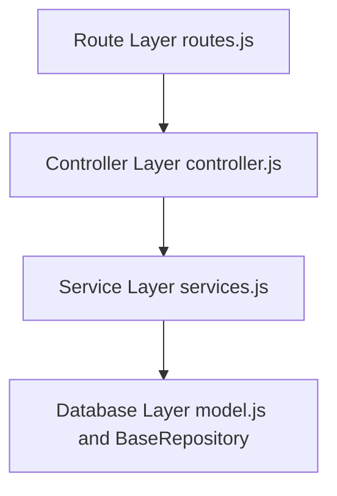

# 🤖 Agent Development Guidelines

**IMPORTANT: READ THIS BEFORE STARTING ANY CODING TASK**

This document provides essential guidelines for coding agents and developers working on the Research Zone Backend project. Always follow these guidelines when contributing to the codebase.

## 📖 Step 1: Documentation Reading Order

**MANDATORY** - Always read in this order before starting any task:

1. **[docs/INDEX.md](../INDEX.md)** - Start here to understand the project structure and find relevant docs
2. **[docs/README.md](../README.md)** - Get overview of tech stack and project
3. **Module-specific documentation** - Read the complete .md file for the module you're working on
4. **[docs/API_REFERENCE.md](../API_REFERENCE.md)** - For data models and endpoint patterns
5. **[docs/ARCHITECTURE.md](../ARCHITECTURE.md)** - For system design and flows
6. **[docs/DEVELOPMENT.md](../DEVELOPMENT.md)** - For setup and debugging

## 🎯 Before Writing Any Code

- [ ] Read the complete module documentation for your feature
- [ ] Understand business logic and requirements
- [ ] Check existing patterns and examples
- [ ] Verify data models and relationships
- [ ] Review error handling expectations
- [ ] Check permission/access control requirements
- [ ] Understand the integration points

## 🏗️ Code Architecture Rules

### Layer Separation (STRICT)

Every module must follow this 3-layer architecture:



**Layer Responsibilities:**

| Layer          | Responsibility     | DO                                                | DON'T                   |
| -------------- | ------------------ | ------------------------------------------------- | ----------------------- |
| **Routes**     | Map HTTP endpoints | Define routes, apply middleware                   | Contain business logic  |
| **Controller** | Handle requests    | Validate input, call service, format response     | Touch database directly |
| **Service**    | Business logic     | Implement logic, permission checks, DB operations | Handle HTTP responses   |
| **Model**      | Data definition    | Define schema, indexes                            | Contain business logic  |

### Example: Adding a New Endpoint

**1. routes.js**

```javascript
router.post("/", checkAccessToken, controller.create);
// ONLY route definition + middleware
// NO business logic here
```

**2. controller.js**

```javascript
static async create(req, res) {
  try {
    const { title } = req.body;  // Extract from request
    const result = await service.create(title, req.user);  // Call service
    return apiResponse.success(res, "Created", 200, result);
  } catch (err) {
    return apiResponse.error(res, err.message, err.statusCode || 500);
  }
}
```

**3. services.js**

```javascript
async create(title, user) {
  // ALL business logic here
  if (!title) throw new ApiError("Title required", 400);
  if (!user.isVerified) throw new ApiError("Not verified", 403);

  const doc = await this.create({ title, createdBy: user.id });
  return doc;
}
```

**4. model.js**

```javascript
const schema = new mongoose.Schema({
  title: { type: String, required: true },
  createdBy: { type: ObjectId, ref: "User", index: true },
});
```

## 🔐 Permission & Access Control

### Rule: Always Check Permissions

```javascript
// GOOD ✅
async deleteWorkspace(workspaceId, user) {
  const workspace = await this.findById(workspaceId);

  // Check owner permission
  if (workspace.owner.toString() !== user.id.toString()) {
    throw new ApiError("Only owner can delete", 403);
  }

  return await this.deleteOne({ _id: workspaceId });
}

// BAD ❌
async deleteWorkspace(workspaceId, user) {
  // Missing permission check!
  return await this.deleteOne({ _id: workspaceId });
}
```

### Permission Pattern

For every operation that modifies data:

```javascript
// 1. Get the resource
const resource = await this.findById(resourceId);

// 2. Check if user is allowed
if (resource.owner !== user.id && !user.isAdmin) {
  throw new ApiError("Not authorized", 403);
}

// 3. Perform operation
return await this.updateOne({ _id: resourceId }, updates);
```

## 📝 Error Handling

### Use ApiError Class

```javascript
import { ApiError } from "../../utils/apiError.js";

// Always use ApiError for consistency
throw new ApiError(
  "Error message here",
  statusCode, // 400, 401, 403, 404, 409, 500
  "ERROR_CODE", // Optional, for frontend handling
);
```

### Error Codes

```
400 - Bad Request (missing/invalid input)
401 - Unauthorized (auth required/invalid)
403 - Forbidden (permission denied)
404 - Not Found (resource doesn't exist)
409 - Conflict (constraint violation, duplicate)
422 - Unprocessable (validation error)
500 - Server Error (unexpected error)
```

### Response Format

**Success:**

```javascript
apiResponse.success(res, "Operation successful", 200, data);
// Returns: { success: true, message, data }
```

**Error:**

```javascript
apiResponse.error(res, "Something went wrong", 500);
// Returns: { success: false, message, statusCode }
```

## 🗄️ Database Patterns

### Use BaseRepository Methods

```javascript
// Available in any service extending BaseRepository:

await this.findOne({ email }); // Find single document
await this.findById(id); // Find by _id
await this.create(data); // Create new document
await this.updateOne(filter, updates); // Update single document
await this.deleteOne(filter); // Delete document
await this.aggregate(pipeline); // Complex queries
```

### Indexing Performance

```javascript
// Create indexes for frequently queried fields
schema.index({ email: 1 }); // Single field
schema.index({ workspaceId: 1, createdAt: -1 }); // Compound index

// GOOD: Fast lookups
const user = await this.findOne({ email });

// BAD: Slow scan
const user = await this.findOne({ bio: "something" });
```

### Aggregation for Complex Queries

```javascript
// Use aggregation instead of multiple queries
const pipeline = [
  { $match: { owner: userId } },
  {
    $lookup: {
      from: "users",
      localField: "owner",
      foreignField: "_id",
      as: "ownerDetails",
    },
  },
  { $group: { _id: "$owner", count: { $sum: 1 } } },
  { $project: { count: 1, owner: "$_id" } },
];

const results = await this.aggregate(pipeline);
```

## 🔄 Request-Response Flow

### Standard Endpoint Pattern

```javascript
// ✅ CORRECT PATTERN

// 1. Extract & validate
const { email, title } = req.body;
if (!email || !title) {
  throw new ApiError("Missing fields", 400);
}

// 2. Check authentication (middleware handles this)
const user = req.user;  // From authMiddleware

// 3. Call service
const result = await service.doSomething(email, title, user);

// 4. Return response
return apiResponse.success(res, "Success message", 200, result);

// 5. Error handling (catch block)
catch (err) {
  if (err instanceof ApiError) {
    return apiResponse.error(res, err.message, err.statusCode);
  }
  return apiResponse.error(res, "Unknown error", 500);
}
```

## 🔑 Key Principles

### 1. DRY (Don't Repeat Yourself)

❌ **Bad** - Repeating permission check:

```javascript
// In endpoint A
if (user.id !== resource.owner) throw new Error("Not owner");

// In endpoint B
if (user.id !== resource.owner) throw new Error("Not owner");
```

✅ **Good** - Extract to service method:

```javascript
// In service
async checkOwnership(resourceId, user) {
  const resource = await this.findById(resourceId);
  if (resource.owner.toString() !== user.id.toString()) {
    throw new ApiError("Not owner", 403);
  }
}

// Use in both endpoints
await service.checkOwnership(resourceId, user);
```

### 2. Fail Fast

```javascript
// Check prerequisites early
async createWorkspace({ title, user }) {
  // Check required fields first
  if (!title) throw new ApiError("Title required", 400);

  // Check user status
  if (!user.isVerified) throw new ApiError("Not verified", 403);

  // THEN do the expensive operation
  const workspace = await this.create({ title, owner: user.id });

  return workspace;
}
```

### 3. Explicit Over Implicit

```javascript
// ❌ Implicit - what does this mean?
async handle(req, res) {
  const result = await service.process(data);
  res.json(result);
}

// ✅ Explicit - clear intent
async create(req, res) {
  try {
    const { title } = req.body;
    if (!title) throw new ApiError("Title required", 400);

    const workspace = await workspaceService.createWorkspace({
      title,
      user: req.user
    });

    return apiResponse.success(
      res,
      "Workspace created successfully",
      200,
      workspace
    );
  } catch (err) {
    return apiResponse.error(
      res,
      err.message || "Failed to create workspace",
      err.statusCode || 500
    );
  }
}
```

### 4. Single Responsibility

```javascript
// ❌ Too many responsibilities
async handleRequest(req, res) {
  // Validates input
  // Checks permissions
  // Modifies database
  // Sends email
  // Updates cache
  // Returns response
}

// ✅ Single responsibility
// Controller: Handle request
async create(req, res) {
  const { title } = req.body;
  const workspace = await service.create(title, req.user);
  return apiResponse.success(res, "Created", 200, workspace);
}

// Service does everything
async create(title, user) {
  this.validate(title);
  this.checkPermissions(user);
  const ws = await this.create({ title, owner: user.id });
  await this.notifyUser(user); // If needed
  return ws;
}
```

## 🧪 Testing Your Code

### Before Committing

- [ ] Test happy path (everything works)
- [ ] Test error cases (invalid input, missing fields)
- [ ] Test permission denial
- [ ] Test database edge cases
- [ ] Use provided `.http` files to test endpoints

### Testing with REST Client

```http
### Create Workspace (Happy Path)
POST http://localhost:5000/api/workspaces
Authorization: Bearer {{token}}
Content-Type: application/json

{
  "title": "Research Project"
}

### Create Workspace (Missing Title)
POST http://localhost:5000/api/workspaces
Authorization: Bearer {{token}}
Content-Type: application/json

{
  "title": ""
}
```

## 🐛 Debugging Tips

### 1. Add Strategic Logging

```javascript
async signupUser(userData) {
  console.log("Signup attempt:", userData.email);

  const user = await this.findOne({ email: userData.email });
  console.log("User found:", !!user);

  if (user && user.isVerified) {
    console.log("User already verified");
    throw new ApiError("User exists", 409);
  }

  const otp = generateOTP();
  console.log("Generated OTP:", otp);  // Remove in production!

  const saved = await this.create(userData);
  console.log("User saved:", saved._id);

  return saved;
}
```

### 2. Check Token Contents

```javascript
// In controller, log the authenticated user
console.log("req.user:", req.user);

// Should be: { id, email, firstName, iat, exp }
```

### 3. Database Query Debugging

```javascript
mongoose.set("debug", true); // Log all queries

// Now in console you'll see every MongoDB operation
```

## 📋 Code Review Checklist

Before submitting code for review:

- [ ] Follows 3-layer architecture
- [ ] All business logic in services
- [ ] Controllers only handle requests
- [ ] Permission checks implemented
- [ ] Error handling with ApiError
- [ ] Uses BaseRepository methods
- [ ] Database indexes where needed
- [ ] No console.log() left in code
- [ ] Variable names are clear
- [ ] Comments for complex logic
- [ ] Follows existing code style
- [ ] Tested manually
- [ ] Documentation updated

## 🚀 Common Task Templates

### Adding a Simple GET Endpoint

**1. Define route in routes.js:**

```javascript
router.get("/:id", checkAccessToken, controller.getById);
```

**2. Add controller method:**

```javascript
static async getById(req, res) {
  try {
    const { id } = req.params;
    const item = await itemDb.findById(id);

    if (!item) {
      throw new ApiError("Not found", 404);
    }

    return apiResponse.success(res, "Retrieved", 200, item);
  } catch (err) {
    return apiResponse.error(res, err.message, err.statusCode || 500);
  }
}
```

**3. Add service method:**

```javascript
async getById(id) {
  return await this.findById(id);
}
```

### Adding a DELETE Endpoint with Permission Check

**1. Route:**

```javascript
router.delete("/:id", checkAccessToken, controller.delete);
```

**2. Controller:**

```javascript
static async delete(req, res) {
  try {
    const { id } = req.params;
    const user = req.user;

    await itemDb.deleteItem(id, user);

    return apiResponse.success(res, "Deleted", 200);
  } catch (err) {
    return apiResponse.error(res, err.message, err.statusCode || 500);
  }
}
```

**3. Service:**

```javascript
async deleteItem(id, user) {
  const item = await this.findById(id);

  if (!item) {
    throw new ApiError("Not found", 404);
  }

  // Permission check
  if (item.owner.toString() !== user.id.toString()) {
    throw new ApiError("Not owner", 403);
  }

  return await this.deleteOne({ _id: id });
}
```

### Adding an Endpoint with Validation

**1. Controller (validate first):**

```javascript
static async create(req, res) {
  try {
    const { email, title } = req.body;

    // Validate required fields
    if (!email || !title) {
      throw new ApiError("Email and title required", 400);
    }

    // Validate email format
    if (!email.includes('@')) {
      throw new ApiError("Invalid email", 400);
    }

    const result = await service.create({ email, title }, req.user);
    return apiResponse.success(res, "Created", 200, result);
  } catch (err) {
    return apiResponse.error(res, err.message, err.statusCode || 500);
  }
}
```

**2. Service (business logic):**

```javascript
async create({ email, title }, user) {
  // Check if user is verified
  if (!user.isVerified) {
    throw new ApiError("Account not verified", 403);
  }

  // Check if email already exists
  const exists = await this.findOne({ email });
  if (exists) {
    throw new ApiError("Email already exists", 409);
  }

  // Create the document
  return await this.create({
    email,
    title,
    createdBy: user.id
  });
}
```

## 📚 Important Patterns to Follow

### Pattern 1: Email Notifications

```javascript
// ALWAYS send email AFTER successful database save
// If email fails, consider rolling back

async signupUser(userData) {
  // 1. Create user
  const user = await this.create(userData);

  // 2. THEN send email
  try {
    await sendEmail(user.email, "Welcome!", template);
  } catch (error) {
    console.error("Email failed, rolling back user");
    await this.deleteOne({ _id: user._id });
    throw error;
  }

  return user;
}
```

### Pattern 2: Permission Check Before Modification

```javascript
async updateItem(itemId, updates, user) {
  // 1. Get the resource
  const item = await this.findById(itemId);

  // 2. Check permission BEFORE modifying
  if (item.owner.toString() !== user.id.toString()) {
    throw new ApiError("Not authorized", 403);
  }

  // 3. THEN update
  return await this.updateOne({ _id: itemId }, { $set: updates });
}
```

### Pattern 3: Transaction for Complex Operations

```javascript
async complexOperation(data, user) {
  const session = await mongoose.startSession();
  session.startTransaction();

  try {
    // Multiple operations
    const ws = await Workspace.create([{ ...data }], { session });
    const member = await Member.create([{ workspace: ws._id, user: user._id }], { session });

    await session.commitTransaction();
    return ws;
  } catch (error) {
    await session.abortTransaction();
    throw error;
  } finally {
    session.endSession();
  }
}
```

## 🚫 Anti-Patterns to Avoid

### ❌ Anti-Pattern 1: Unprotected Routes

```javascript
// WRONG - Anyone can access
router.delete("/:id", controller.delete);

// CORRECT - Requires authentication
router.delete("/:id", checkAccessToken, controller.delete);
```

### ❌ Anti-Pattern 2: No Permission Checks

```javascript
// WRONG - Any user can delete any document
router.delete("/items/:id", checkAccessToken, async (req, res) => {
  await Item.deleteOne({ _id: req.params.id });
});

// CORRECT - Check owner
router.delete("/items/:id", checkAccessToken, controller.delete);
// then in service: check if user is owner before deleting
```

### ❌ Anti-Pattern 3: Mixing Logic Layers

```javascript
// WRONG - Database query in controller
router.post("/", async (req, res) => {
  const user = await User.findOne({ email: req.body.email });
  if (user) res.status(409).json({ error: "User exists" });
});

// CORRECT - Call service
router.post("/", controller.signup);
// Service handles the query
```

### ❌ Anti-Pattern 4: Silent Failures

```javascript
// WRONG - Error caught but not handled
try {
  await sendEmail(email, subject, html);
} catch (err) {
  console.log("Error"); // Just logs, doesn't throw
}

// CORRECT - Throw error to be handled by caller
try {
  await sendEmail(email, subject, html);
} catch (err) {
  throw new ApiError("Failed to send email", 500);
}
```

### ❌ Anti-Pattern 5: Exposed Secrets

```javascript
// WRONG
console.log("JWT Secret:", process.env.JWT_SECRET);
return { password: user.password };

// CORRECT
console.log("JWT verified successfully");
return { id: user._id, email: user.email }; // Never password
```

## 🎓 Learning Resources

When working on a specific module:

1. Read the complete module documentation first
2. Check existing code in that module for patterns
3. Look at similar modules for examples
4. Review [ARCHITECTURE.md](../ARCHITECTURE.md) for data flows
5. Check [API_REFERENCE.md](../API_REFERENCE.md) for models
6. Consult [DEVELOPMENT.md](../DEVELOPMENT.md) for debugging

## 📞 Need Help?

1. **Understanding module**: Read its docs/modules/\*/README.md
2. **How to implement X**: Check [DEVELOPMENT.md](../DEVELOPMENT.md#adding-a-new-endpoint)
3. **Debugging issue**: See [DEVELOPMENT.md](../DEVELOPMENT.md#common-issues--solutions)
4. **API patterns**: Check [API_REFERENCE.md](../API_REFERENCE.md)
5. **System design**: Review [ARCHITECTURE.md](../ARCHITECTURE.md)

---

**Remember:** This codebase is maintained by teams using automated agents. Following these guidelines ensures code quality, consistency, and maintainability for everyone.

**Last Updated**: March 28, 2024
**Version**: 1.0.0
