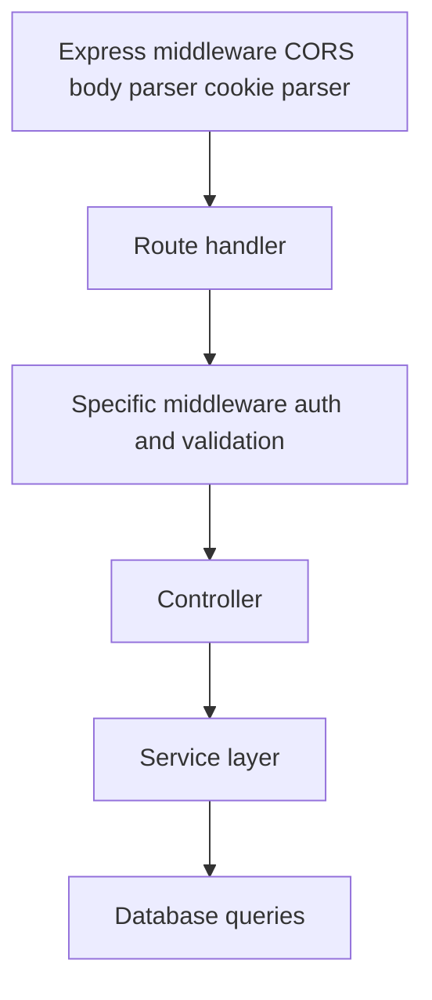

# API Reference & Data Models

Quick reference guide for all the main data structures and API patterns used in the Research Zone backend.

## Global Response Format

All API responses follow this standard format:

### Success Response (2xx Status)

```json
{
  "success": true,
  "message": "Operation successful",
  "data": {
    // Response data object(s)
  }
}
```

### Error Response (4xx/5xx Status)

```json
{
  "success": false,
  "message": "Error message describing what went wrong",
  "statusCode": 400,
  "code": "ERROR_CODE"
}
```

## Data Models

### User Model

**Collection**: `users`

```javascript
{
  _id: ObjectId,
  email: String,                      // Unique, lowercase
  passwordHash: String,               // Optional (for local auth)
  firstName: String (required),
  lastName: String,
  username: String,                   // Unique, sparse
  profilePictureUrl: String,
  authProviders: [String],            // ['local', 'google', 'github', 'kaggle']
  isVerified: Boolean,                // Auto-false, set true on OTP verification
  otp: Number,                        // 4-digit code
  otpExpiresAt: Date,                // 5 minutes from generation
  refreshToken: String,              // Stored after OTP verification
  createdAt: Date,
  updatedAt: Date                    // Auto-updated by mongoose
}
```

**Indexes**:

- `email`: Unique ascending
- `username`: Unique sparse ascending

**Key Methods** (from UserService):

- `signupUser(userData)`: Register new user
- `verifyOtp(otp)`: Verify OTP and activate account
- `resendOtp(token)`: Send new OTP
- `generateAccessToken(user)`: Create JWT
- `sendCookie(res, token, maxAge)`: Set refresh token cookie
- `hashPassword(password)`: Secure hash

**Usage**:

```javascript
import User from "./model.js";
import userServices from "./services.js";

const userDb = new userServices(User);
const user = await userDb.findOne({ email });
```

---

### Workspace Model

**Collection**: `workspaces`

```javascript
{
  _id: ObjectId,
  title: String (required),           // Workspace name
  owner: ObjectId (ref: User),        // Owner's user ID (indexed)
  members: [
    {
      user: ObjectId (ref: User),
      joinedAt: Date                  // When member joined
    }
  ],
  color: String,                      // Auto-assigned from palette
  inviteCode: String,                 // UUID, unique
  createdAt: Date,
  updatedAt: Date
}
```

**Indexes**:

- `owner`: Ascending (query workspaces by owner)
- `inviteCode`: Unique (find by invite code)

**Schema Hooks**:

- `pre('save')`: Auto-assign color if not provided

**Key Methods** (from WorkspaceService):

- `createWorkspace({ title, user })`: Create new workspace
- `getOwnerWorkspaces(user)`: Get owned workspaces with details
- `getAllWorkspaces(user)`: Get owned + joined workspaces
- `inviteUserToWorkspace({ email, workspaceId, inviter })`: Send invite
- `verifyInvitationToken(token)`: Validate invitation
- `acceptInvitation({ token, user })`: Join workspace
- `getWorkspacePipeline()`: Complex aggregation

**Relationships**:

- `owner` → User (one user owns many workspaces)
- `members[].user` → User (many users are members)

**Usage**:

```javascript
import Workspace from "./model.js";
import workspaceServices from "./services.js";

const workspaceDb = new workspaceServices(Workspace);
const workspace = await workspaceDb.createWorkspace({
  title: "AI Research",
  user: req.user,
});
```

---

### Workspace Invitation Model

**Collection**: `workspaceinvitations`

```javascript
{
  _id: ObjectId,
  email: String,                      // Target invitee email
  workspaceId: ObjectId (ref: Workspace),
  inviterId: ObjectId (ref: User),   // Who sent the invite
  token: String (unique),             // JWT for verification
  status: String,                     // 'pending', 'accepted', 'declined'
  createdAt: Date,
  expiresAt: Date,                   // 7 days from creation
  acceptedAt: Date                   // When invitation was accepted
}
```

**Indexes**:

- `token`: Unique (lookup invitations by token)
- `status`: Ascending (find pending invitations)
- `expiresAt`: (TTL index for auto-cleanup)

**Validation**:

- Only one pending invitation per email+workspaceId combination
- Token must be valid and not expired
- Email address must not already be workspace member

---

### Folder Model (Linked to Workspaces)

**Collection**: `folders`

```javascript
{
  _id: ObjectId,
  workspaceId: ObjectId (ref: Workspace),
  name: String (required),            // Folder name
  parentFolder: ObjectId (ref: Folder),  // For nesting
  createdBy: ObjectId (ref: User),
  createdAt: Date,
  updatedAt: Date
}
```

**Capabilities**:

- Hierarchical structure (subfolders)
- Only root folders have `parentFolder: null`
- Created by member, editable/deletable by owner or creator

---

### Saved Paper Model (Linked to Workspaces)

**Collection**: `savedpapers`

```javascript
{
  _id: ObjectId,
  workspaceId: ObjectId (ref: Workspace),
  paperId: ObjectId (ref: Paper),
  folderId: ObjectId (ref: Folder),   // Optional, for organization
  savedBy: ObjectId (ref: User),      // Who saved it
  notes: String,                      // User's notes on paper
  tags: [String],                     // Custom tags
  savedAt: Date,
  updatedAt: Date
}
```

**Features**:

- Same paper can be saved in multiple workspaces
- Different notes per workspace
- Accessible by all workspace members

---

### Chat Message Model (Linked to Workspaces)

**Collection**: `messages`

```javascript
{
  _id: ObjectId,
  workspaceId: ObjectId (ref: Workspace),
  sender: ObjectId (ref: User),
  content: String,
  type: String,                       // 'text', 'image', 'file'
  attachments: [
    {
      url: String,
      type: String,                   // mime type
      name: String
    }
  ],
  reactions: [
    {
      emoji: String,
      users: [ObjectId (ref: User)]
    }
  ],
  createdAt: Date,
  updatedAt: Date
}
```

**Real-time Events** (Socket.io):

- `message:new`: New message posted
- `message:deleted`: Message deleted
- `user:typing`: User typing indicator
- `user:stopped-typing`: User stopped typing

---

### Paper Chat Model (Paper-Specific Discussions)

**Collection**: `paperchats` or `conversations`

```javascript
{
  _id: ObjectId,
  paperId: ObjectId (ref: Paper),
  workspaceId: ObjectId (ref: Workspace),
  participantCount: Number,
  lastMessageAt: Date,
  summaries: String,                  // AI-generated summary
  messages: [
    {
      _id: ObjectId,
      sender: ObjectId (ref: User),
      content: String,
      createdAt: Date,
      reactions: [
        {
          emoji: String,
          users: [ObjectId]
        }
      ]
    }
  ],
  createdAt: Date,
  updatedAt: Date
}
```

---

## API Endpoint Summary

### Authentication Endpoints

```
POST   /api/auth/signup              → Send OTP
POST   /api/auth/verify-otp          → Verify and create account
POST   /api/auth/resend-otp/:token   → Resend OTP
POST   /api/auth/login               → (Inferred) Login with email/password
POST   /api/auth/logout              → Clear cookies
POST   /api/auth/refresh             → Get new access token
```

### Workspace Endpoints

```
POST   /api/workspaces               → Create workspace
GET    /api/workspaces               → Get all workspaces (owned + joined)
GET    /api/workspaces/owner         → Get owned workspaces only
GET    /api/workspaces/:id           → Get workspace details
PUT    /api/workspaces/:id           → Update workspace (owner only)
DELETE /api/workspaces/:id           → Delete workspace (owner only)

POST   /api/workspaces/:id/invite    → Send invitation
POST   /api/invitations/verify       → Verify invitation token
POST   /api/invitations/accept       → Accept and join workspace
```

### Folder Endpoints

```
POST   /api/workspaces/:id/folders           → Create folder
GET    /api/workspaces/:id/folders           → List folders
PUT    /api/folders/:id                      → Update folder
DELETE /api/folders/:id                      → Delete folder
POST   /api/folders/:id/move                 → Move papers
```

### Saved Papers Endpoints

```
POST   /api/workspaces/:id/saved-papers      → Save paper
GET    /api/workspaces/:id/saved-papers      → List saved papers
PUT    /api/saved-papers/:id                 → Update notes/tags
DELETE /api/saved-papers/:id                 → Remove paper
```

### Chat Endpoints

```
GET    /api/workspaces/:id/messages          → Get workspace chat
POST   /api/workspaces/:id/messages          → Post message
DELETE /api/messages/:id                     → Delete message

GET    /api/papers/:id/chat                  → Get paper discussion
POST   /api/papers/:id/chat                  → Post to discussion
```

---

## Common Request/Response Patterns

### Paginated List Response

```json
{
  "success": true,
  "message": "Data retrieved",
  "data": {
    "items": [
      {
        /* item 1 */
      },
      {
        /* item 2 */
      }
    ],
    "pagination": {
      "total": 100,
      "page": 1,
      "pageSize": 20,
      "totalPages": 5
    }
  }
}
```

### Error with Validation

```json
{
  "success": false,
  "message": "Validation failed",
  "statusCode": 400,
  "errors": [
    {
      "field": "email",
      "message": "Invalid email format"
    },
    {
      "field": "username",
      "message": "Username already exists"
    }
  ]
}
```

### File Upload Response

```json
{
  "success": true,
  "message": "File uploaded",
  "data": {
    "fileId": "507f1f77bcf86cd799439011",
    "filename": "paper.pdf",
    "size": 1024000,
    "mimeType": "application/pdf",
    "url": "https://cdn.research-zone.com/papers/abc123def456.pdf",
    "uploadedAt": "2024-03-28T10:00:00Z"
  }
}
```

---

## Authentication Headers

All protected endpoints require:

```
Authorization: Bearer <access-token>
```

**Token Structure** (JWT):

```javascript
{
  id: "507f1f77bcf86cd799439011",
  email: "user@example.com",
  firstName: "John",
  iat: 1711606400,        // Issued at
  exp: 1711607200         // Expiration
}
```

---

## Status Codes

| Code | Meaning              | Common Cause                         |
| ---- | -------------------- | ------------------------------------ |
| 200  | OK                   | Request succeeded                    |
| 201  | Created              | Resource created                     |
| 400  | Bad Request          | Invalid input/missing fields         |
| 401  | Unauthorized         | Missing/invalid auth token           |
| 403  | Forbidden            | Insufficient permissions             |
| 404  | Not Found            | Resource doesn't exist               |
| 409  | Conflict             | Resource exists/constraint violation |
| 422  | Unprocessable Entity | Validation error                     |
| 500  | Server Error         | Unexpected error                     |
| 503  | Service Unavailable  | Database/external service down       |

---

## Query Parameters

### Common Pagination

```
GET /api/papers?page=1&limit=20&sort=-createdAt
Parameters:
  page: Number (default: 1)
  limit: Number (default: 20, max: 100)
  sort: String (field name, prefix - for desc)
```

### Filtering

```
GET /api/workspaces?owner=true&status=active
Parameters:
  owner: Boolean (workspaces user owns)
  status: String (enum values)
```

### Search

```
GET /api/papers?search=neural+networks
Parameters:
  search: String (full-text search)
  searchFields: String (comma-separated field names)
```

---

## Error Code Reference

### Authentication Errors

```
USER_EXISTS                   → User already registered and verified
USERNAME_EXISTS               → Username is taken
AUTH_NOT_PROVIDED             → Missing Authorization header
TOKEN_EXPIRED                 → JWT token has expired
INVALID_CREDENTIALS           → Wrong email/password
INVALID_TOKEN                 → Token signature invalid
OTP_VERIFICATION_FAILED       → Invalid or expired OTP
SESSION_EXPIRED               → Please log in again
```

### Workspace Errors

```
WORKSPACE_NOT_FOUND           → Workspace ID doesn't exist
NOT_OWNER                     → Only owner can perform this action
NOT_MEMBER                    → User not in workspace
ALREADY_MEMBER                → User already in workspace
INVITATION_EXISTS             → Pending invitation already sent
INVITATION_FAILED             → Failed to send invitation
TITLE_NOT_FOUND               → Workspace title is required
```

### Permission Errors

```
INSUFFICIENT_PERMISSIONS      → Insufficient permissions for action
ACCESS_DENIED                 → Access denied to resource
FORBIDDEN_ACTION              → Action not allowed
```

### Server Errors

```
DATABASE_ERROR                → Database operation failed
EMAIL_SERVICE_ERROR           → Email sending failed
FILE_UPLOAD_ERROR             → File upload failed
EXTERNAL_SERVICE_ERROR        → External API call failed
```

---

## Middleware Chain

Every request passes through:



**Common Middleware**:

```javascript
import { checkAccessToken } from "../middlewares/authMiddleware.js";
import { validateInputs } from "../middlewares/formValidation.js";
import { uploadFile } from "../middlewares/s3UploadMiddleware.js";

// Protect route with auth
router.post("/private", checkAccessToken, controller.method);

// Validate inputs
router.post("/create", validateInputs(schema), controller.method);

// Handle file upload
router.post("/upload", uploadFile.single("file"), controller.method);
```

---

## Database Connection

**Mongoose Connection** (from dbConfig.js):

```javascript
mongoose.connect(MONGODB_URI, {
  // Connection options
});
```

**Typical Query Pattern**:

```javascript
// In service (extends BaseRepository)
const doc = await this.findOne({ email });
const updated = await this.updateOne({ _id }, { $set: newData });
const many = await this.aggregate(pipeline);
```

---

## Environment Configuration

**Required vars** (from constants/config.js):

```javascript
export const config = {
  MONGODB_URI: process.env.MONGODB_URI,
  JWT_SECRET: process.env.JWT_SECRET,
  GOOGLE_CLIENT_ID: process.env.GOOGLE_CLIENT_ID,
  GOOGLE_CLIENT_SECRET: process.env.GOOGLE_CLIENT_SECRET,
  MAIL_SERVICE: process.env.MAIL_SERVICE,
  AWS_REGION: process.env.AWS_REGION,
  CLOUDFRONT_DOMAIN: process.env.CLOUDFRONT_DOMAIN,
  PORT: process.env.PORT || 5000,
  NODE_ENV: process.env.NODE_ENV,
};

export const constants = {
  VERIFICATION_EMAIL_SUBJECT: "Verify your email",
  OTP_EXPIRY_MINUTES: 5,
  TOKEN_EXPIRY: "20m",
  REFRESH_TOKEN_EXPIRY: "7d",
};
```

---

## Testing with HTTP Files

Use VS Code REST Client extension to test endpoints:

```http
### Signup
POST http://localhost:5000/api/users/signup
Content-Type: application/json

{
  "email": "test@example.com",
  "firstName": "Test",
  "lastName": "User",
  "username": "testuser",
  "password": "TestPass123"
}

### Verify OTP
POST http://localhost:5000/api/users/verify-otp
Authorization: Bearer {{signup_token}}
Content-Type: application/json

{
  "otp": 1234
}

### Create Workspace
POST http://localhost:5000/api/workspaces
Authorization: Bearer {{access_token}}
Content-Type: application/json

{
  "title": "My Research Workspace"
}

### Get All Workspaces
GET http://localhost:5000/api/workspaces
Authorization: Bearer {{access_token}}
```

---

## Quick Integration Checklist

- [ ] Authentication middleware configured
- [ ] Database indexes created
- [ ] Email service initialized
- [ ] Populate constants with values
- [ ] Set environment variables
- [ ] Test signup-to-OTP flow
- [ ] Test workspace creation
- [ ] Test invitation sending
- [ ] Configure CORS for frontend
- [ ] Setup Socket.io for real-time

---
