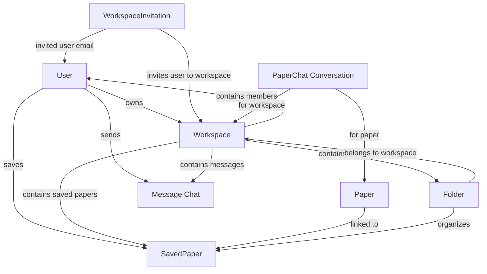
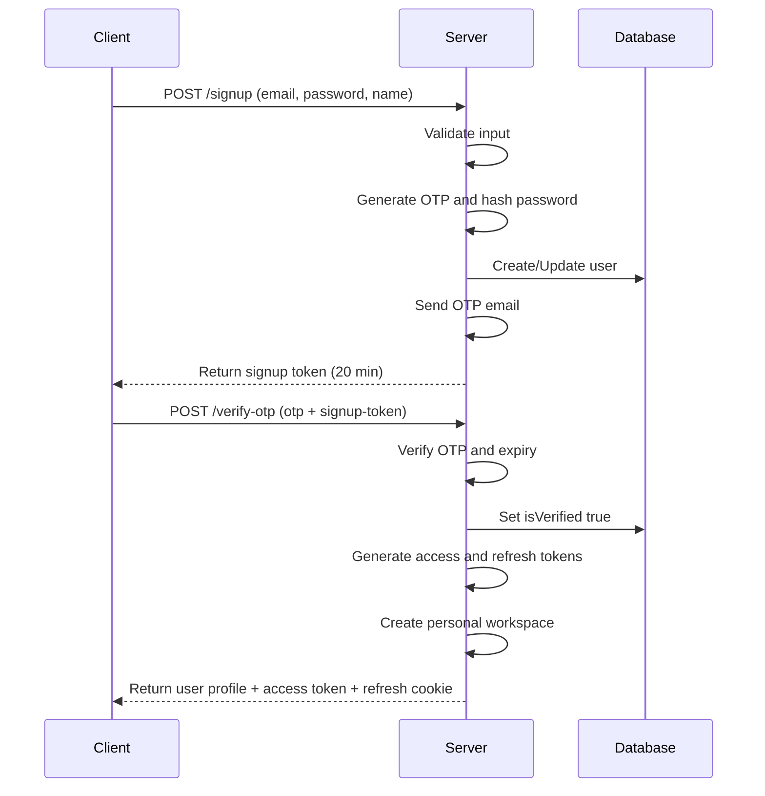
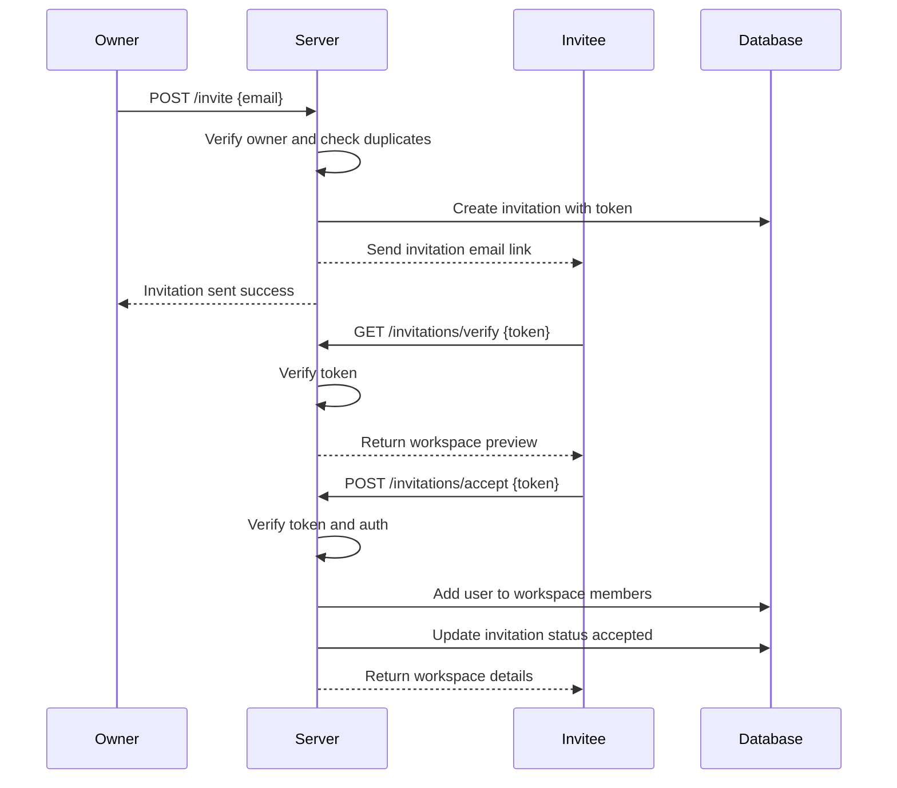
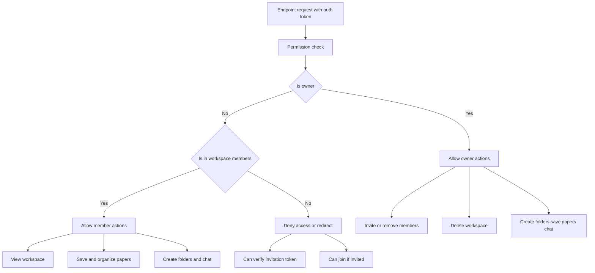
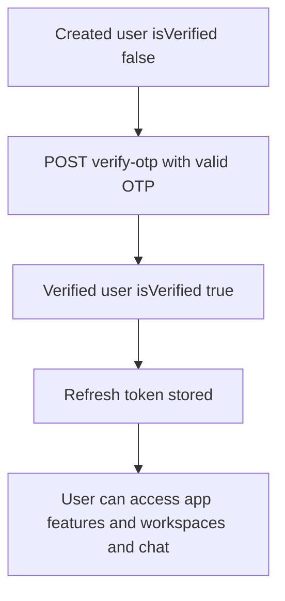
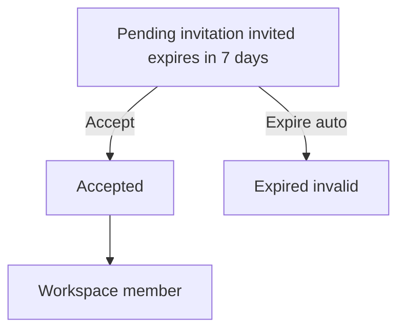
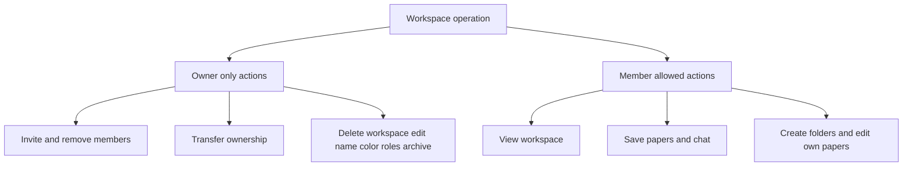
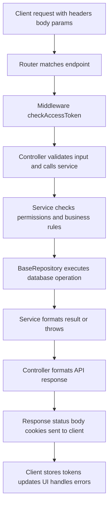
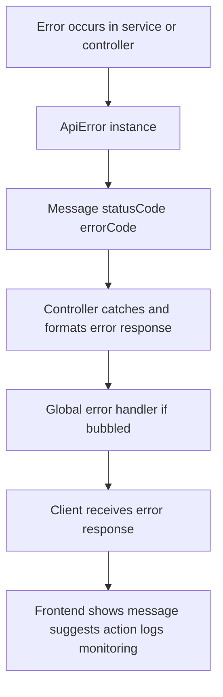
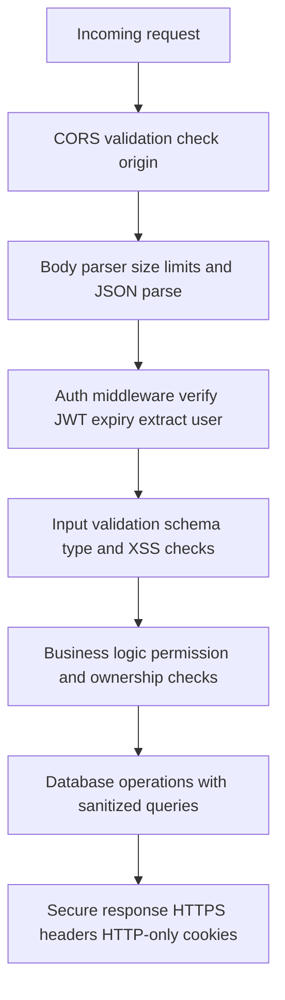

# Architecture & Data Relationships

## Entity Relationship Diagram



## Relationship Types

### 1:N (One-to-Many) Relationships

| Parent    | Child      | Field                    | Notes                                   |
| --------- | ---------- | ------------------------ | --------------------------------------- |
| User      | Workspace  | `workspace.owner`        | 1 user owns many workspaces             |
| User      | Message    | `message.sender`         | 1 user sends many messages              |
| User      | SavedPaper | `savedpaper.savedBy`     | 1 user saves many papers                |
| Workspace | Message    | `message.workspaceId`    | 1 workspace has many messages           |
| Workspace | SavedPaper | `savedpaper.workspaceId` | 1 workspace has many saved papers       |
| Workspace | Folder     | `folder.workspaceId`     | 1 workspace has many folders            |
| Workspace | Member     | `workspace.members[]`    | 1 workspace has many members            |
| Paper     | SavedPaper | `savedpaper.paperId`     | 1 paper can be saved in many workspaces |
| Folder    | SavedPaper | `savedpaper.folderId`    | 1 folder contains many papers           |

### M:N (Many-to-Many) Relationships

| Entity 1  | Entity 2     | Through                | Type                                      |
| --------- | ------------ | ---------------------- | ----------------------------------------- |
| Workspace | User         | `workspace.members[]`  | Members can belong to multiple workspaces |
| User      | AuthProvider | `user.authProviders[]` | Users can have multiple auth methods      |

### Nested/Embedded Relationships

```javascript
// Workspace members embedeed in workspace document
workspace.members = [
  { user: ObjectId, joinedAt: Date },
  { user: ObjectId, joinedAt: Date }
]

// Chat reactions embedded in message
message.reactions = [
  { emoji: "👍", users: [ObjectId, ObjectId] },
  { emoji: "😂", users: [ObjectId] }
]

// Paper chat messages embedded in conversation
conversation.messages = [
  { sender: ObjectId, content: String, reactions: [], createdAt: Date },
  ...
]
```

## Data Flow Architecture

### Authentication System



### Workspace Invitation System



### Workspace Member Access



## Data State Transitions

### User State Diagram



### Workspace Invitation State Diagram



### Workspace Operation Permissions



## Request/Response Flow

### Typical Protected Endpoint Flow



## Database Query Patterns

### Simple CRUD Operations

```javascript
// Create
const user = await userDb.create({
  email: "user@example.com",
  firstName: "John",
  // ...
});

// Read
const user = await userDb.findOne({ email });
const user = await userDb.findById(userId);

// Update
await userDb.updateOne({ _id: userId }, { $set: { isVerified: true } });

// Delete
await userDb.deleteOne({ _id: userId });
```

### Complex Queries with Aggregation

```javascript
// Get owner workspaces with member count
const pipeline = buildOwnerWorkspacesPipeline(userId);
const workspaces = await workspaceDb.aggregate(pipeline);

// Pipeline steps:
// 1. $match: Filter workspaces by owner
// 2. $lookup: Join with User collection for member details
// 3. $group: Count members and papers
// 4. $project: Select fields for response
```

### Bulk Operations

```javascript
// Update multiple documents
await Model.updateMany({ condition }, { $set: { field: value } });

// Delete multiple
await Model.deleteMany({ condition });
```

### Transaction Example (if needed)

```javascript
// For multi-document transactions
const session = await mongoose.startSession();
session.startTransaction();

try {
  await User.create([userData], { session });
  await Workspace.create([wsData], { session });
  await session.commitTransaction();
} catch (error) {
  await session.abortTransaction();
  throw error;
} finally {
  session.endSession();
}
```

## Caching Strategy

**No caching currently implemented, but recommended for:**

1. **User Profile** (refresh on logout)

   ```javascript
   // Cache: user_{id}
   // TTL: 1 hour or refresh on changes
   ```

2. **Workspace List** (refresh on workspace changes)

   ```javascript
   // Cache: ws_list_{userId}
   // TTL: 5 minutes or invalidate on ops
   ```

3. **Member List** (refresh on invite/remove)

   ```javascript
   // Cache: ws_{wsId}_members
   // TTL: 10 minutes or invalidate
   ```

4. **Invitation** (valid until expiry)
   ```javascript
   // Cache: invitation_{token}
   // TTL: until expiry date
   ```

## Scalability Considerations

### Current Bottlenecks

1. **N+1 queries**: Aggregation adds lookups
   - Solution: Already using aggregation pipelines

2. **Embedded members array**
   - Solution: OK for small teams, consider sharding at scale

3. **Single MongoDB replica**
   - Solution: Implement replica sets for high availability

### Optimization Opportunities

1. **Redis caching layer**

   ```javascript
   // Cache tokens, user profiles, workspace lists
   ```

2. **Database sharding**

   ```javascript
   // Shard by workspaceId for saved papers
   ```

3. **Pagination**

   ```javascript
   // Implement limit/offset for large datasets
   ```

4. **Indexing strategy**
   ```javascript
   // Add compound indexes for common queries
   // e.g., { workspaceId: 1, createdAt: -1 }
   ```

## Error Handling Flow



## Security Layers



---

**Architecture Version**: 1.0.0
**Last Updated**: March 28, 2024
