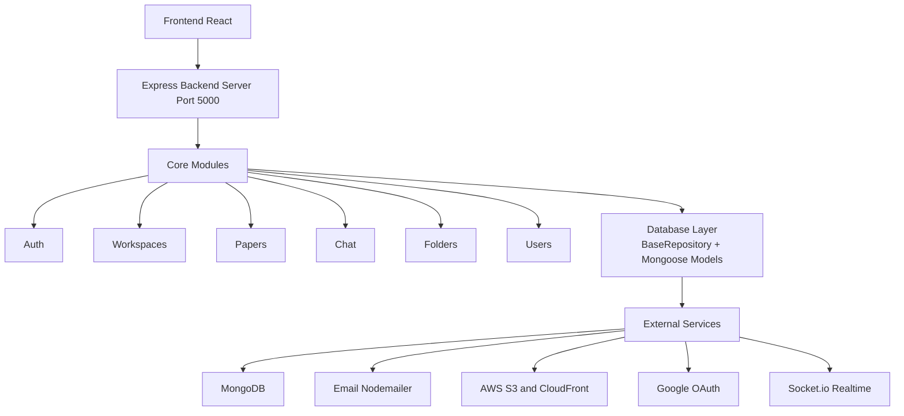
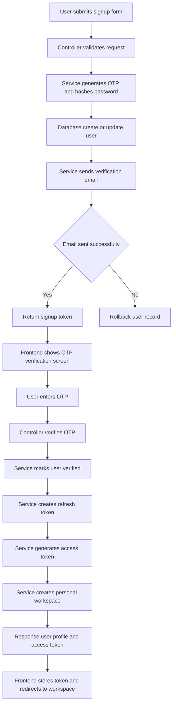
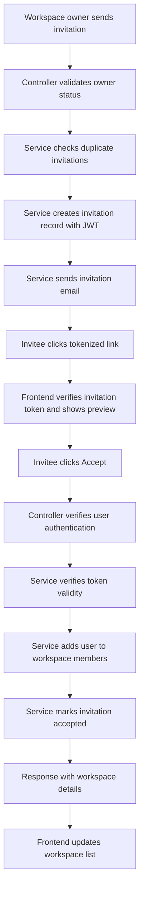
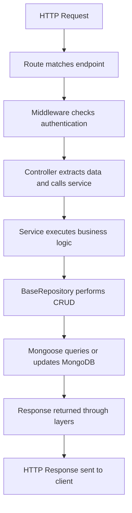
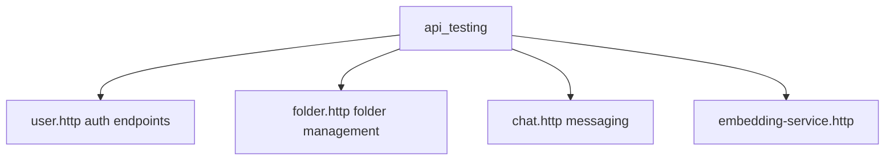

# Research Zone Backend - Documentation

Welcome to the Research Zone Backend documentation. This folder contains comprehensive documentation to help developers and coding agents understand the project structure, business logic, and implementation details.

## 🚀 Start Here

**For AI/Coding Agents**: Begin with [AGENT_GUIDELINES.md](./AGENT_GUIDELINES.md) → [INDEX.md](./INDEX.md)

**For Developers**: Read this README → [DEVELOPMENT.md](./DEVELOPMENT.md) → [ARCHITECTURE.md](./ARCHITECTURE.md)

## Quick Navigation

### MUST READ for Agents

- **[AGENT_GUIDELINES.md](./AGENT_GUIDELINES.md)** - Coding standards, best practices, mandatory patterns
- **[INDEX.md](./INDEX.md)** - Complete navigation guide for all modules and concepts

### Core Modules

1. **[Authentication Module](./modules/authentication/README.md)**
   - User registration, OTP verification, multi-provider auth
   - JWT token management
   - Security features and email validation
   - **Key concepts:** Signup flow, OTP expiry, token lifecycle

2. **[Workspaces Module](./modules/workspaces/README.md)**
   - Collaborative workspace creation and management
   - User invitations and access control
   - **Key concepts:** Owner permissions, invitation flow, aggregation pipelines

### Additional Modules

- **[Papers Module](./modules/papers/README.md)** - File uploads, S3 storage, metadata, search
- **[Chat Module](./modules/chat/README.md)** - Real-time workspace messaging, Socket.io
- **[Paper-Chat Module](./modules/paper-chat/README.md)** - Paper discussions, nested messages
- **[Folders Module](./modules/folders/README.md)** - Hierarchical paper organization
- **[Saved Papers Module](./modules/saved-papers/README.md)** - Annotations, highlights, save tracking

### Foundation Documents

- **[ARCHITECTURE.md](./ARCHITECTURE.md)** - System design, data flow, relationships, patterns
- **[API_REFERENCE.md](./API_REFERENCE.md)** - All endpoints, data models, error codes
- **[DEVELOPMENT.md](./DEVELOPMENT.md)** - Setup, debugging, testing, workflows

## Project Overview

**Research Zone** is a collaborative research paper management platform where:

- **Users** sign up via email OTP verification
- **Users** create **workspaces** for team collaboration
- **Users** invite colleagues to join workspaces
- **Teams** organize papers in folders
- **Teams** discuss papers in real-time chat
- **Complex ML workflows** process and summarize paper content

### Architecture Diagram



## Technology Stack

### Backend

- **Runtime**: Node.js (Express.js v5.1.0)
- **Database**: MongoDB with Mongoose ODM (v8.19.2)
- **Authentication**: JWT (jsonwebtoken v9.0.2), Google OAuth, Multi-provider support
- **Security**: bcryptjs for password hashing (v3.0.2)
- **Real-time**: Socket.io (v4.8.3)
- **File Storage**: AWS S3 with CloudFront CDN
- **Email**: Nodemailer (v7.0.10)
- **Validation**: Zod (v4.1.12)

### Key Dependencies

```
Express.js          - Web framework
Mongoose            - MongoDB ODM
Socket.io           - Real-time communication
JWT                 - Token-based authentication
bcryptjs            - Password hashing
Nodemailer          - Email service
AWS SDK             - S3, CloudFront, SSM
Google Auth Library - OAuth integration
Multer              - File upload handling
CORS                - Cross-origin requests
Cookie Parser       - HTTP cookie handling
```

## Directory Structure

```mermaid
flowchart TD
    SRC[src] --> SERVER[server.js entry point]
    SRC --> CFG[config]
    SRC --> CONST[constants]
    SRC --> MID[middlewares]
    SRC --> MOD[modules]
    SRC --> ROUTES[routes]
    SRC --> UTILS[utils]
    SRC --> AGG[aggregations]
    SRC --> VAL[validations]

    CFG --> DBC[dbConfig.js]
    CFG --> SOC[socketConfig.js]

    CONST --> CCFG[config.js]
    CONST --> MSG[messages.js]

    MID --> AM[authMiddleware.js]
    MID --> FV[formValidation.js]
    MID --> S3[s3UploadMiddleware.js]
    MID --> SAM[socketAuthMiddleware.js]

    MOD --> AU[authentication users]
    MOD --> WS[workspaces]
    MOD --> PAP[papers]
    MOD --> CH[chat]
    MOD --> PCH[paper-chat]

    AU --> AUC[controller.js]
    AU --> AUM[model.js]
    AU --> AUR[routes.js]
    AU --> AUS[services.js]

    WS --> WSC[controller.js]
    WS --> WSM[model.js]
    WS --> WSR[routes.js]
    WS --> WSS[services.js]
    WS --> WSI[invitationModel.js]
    WS --> WSF[folders]
    WS --> WSSP[saved-papers]

    ROUTES --> RI[index.js route aggregation]

    UTILS --> UAR[apiResponse.js]
    UTILS --> UAE[apiError.js]
    UTILS --> UBR[baseRepository.js]
    UTILS --> UJWT[generateJWT.js]
    UTILS --> UOTP[generateOtp.js]
    UTILS --> UML[sendMail.js]
    UTILS --> UCFS[cloudFrontSigner.js]
    UTILS --> UET[emailTemplates]

    UET --> UET1[signupOtpTemp.js]
    UET --> UET2[invitationTemp.js]

    AGG --> AGW[workspaces]
    AGG --> AGC[chat]
    AGG --> AGS[saved-papers]

    VAL --> VV[validation.js]
```



## Data Flow Examples

### User Registration Flow



### Join Workspace Flow



## Module Communication

Each module follows a **3-layer architecture**:

1. **Routes Layer**: Define HTTP endpoints
2. **Controller Layer**: Handle requests, validate input
3. **Service Layer**: Business logic and database operations

### Example Request Flow



## Key Concepts to Understand

### 1. BaseRepository Pattern

All service classes extend `BaseRepository` which provides:

- `findOne()`: Find single document
- `findById()`: Find by MongoDB \_id
- `create()`: Insert new document
- `updateOne()`: Update single document
- `deleteOne()`: Delete single document
- `aggregate()`: Complex aggregation queries
- `hashPassword()`: Secure password hashing

**Location**: `src/utils/baseRepository.js`

### 2. JWT Tokens

**Access Token**:

- Short-lived (varies by config)
- Contains user ID, email, firstName
- Used in Authorization header for API calls
- Verified by `authMiddleware`

**Refresh Token**:

- Long-lived (7 days)
- Stored in HTTP-only cookie
- Used to obtain new access tokens
- Never expires for signature verification (refresh endpoint handles expiry)

**Invitation Token**:

- 7-day validity
- Contains minimal data (just for verification)
- Used in workspace invitation flow

### 3. Aggregation Pipelines

Used for complex queries involving lookups and calculations:

- Owner workspaces with member counts
- All workspaces with owner details
- Chat messages with user info
- Paper discussions with metadata

**Location**: `src/aggregations/`

### 4. Email Service Integration

All emails go through:

1. Template generation (HTML)
2. Nodemailer SMTP configuration
3. Send operation
4. Error handling (rollback if needed)

**Key emails**:

- Signup OTP verification
- Workspace invitations

### 5. Socket.io Real-time Events

Handles real-time updates for:

- New messages in chat
- User typing indicators
- Paper updates
- Member presence

## Common Development Tasks

### Adding a New API Endpoint

1. Create the route in module's `routes.js`
2. Add corresponding method in `controller.js`
3. Implement business logic in `services.js`
4. Use BaseRepository methods for DB operations
5. Add appropriate error handling
6. Test with provided `.http` files in `api_testing/`

### Modifying Database Schema

1. Update model in `model.js`
2. Add Mongoose indexes if querying by new field
3. Create data migration (if needed for existing data)
4. Update service layer queries
5. Update API response structures
6. Update documentation

### Adding Email Notifications

1. Create template in `src/utils/emailTemplates/`
2. Call `sendEmail()` function from service
3. Add error handling with rollback
4. Test email template rendering
5. Document email requirements

## Configuration & Environment

**Required Environment Variables:**

```
# Database
MONGODB_URI=mongodb://localhost:27017/research-zone

# JWT
JWT_SECRET=your-secret-key-here
JWT_EXPIRES_IN=20m
REFRESH_TOKEN_EXPIRES=7d

# Email Service
MAIL_SERVICE_ADDRESS=smtp.gmail.com
MAIL_USERNAME=your-email@gmail.com
MAIL_PASSWORD=your-app-password

# OAuth
GOOGLE_CLIENT_ID=your-google-client-id
GOOGLE_CLIENT_SECRET=your-google-secret

# AWS
AWS_REGION=ap-south-1
AWS_ACCESS_KEY_ID=your-access-key
AWS_SECRET_ACCESS_KEY=your-secret-key
CLOUDFRONT_DOMAIN=your-cloudfront-domain.cloudfront.net

# Server
PORT=5000
NODE_ENV=development
```

## Testing

**API Testing Files** (Use with REST Client extension):



Usage: Open any `.http` file in VS Code and click "Send Request"

## Performance Optimization

### Database Indexes

Already implemented:

- Email lookups (users)
- Username lookups (users)
- Owner lookups (workspaces)
- Invite code lookups (workspaces)

**Good practice**: Always index fields used in queries

### Query Optimization

Use aggregation pipelines instead of multiple queries:

```javascript
// Instead of fetching workspace + separate member lookup
// Use aggregation pipeline with $lookup stage
```

### Caching Opportunities

- User profile (refresh on login)
- Workspace list (refresh on workspace changes)
- Member list (refresh on invite/remove)

## Security

### Current Implementations

✅ JWT-based authentication
✅ Password hashing with bcryptjs
✅ HTTP-only cookies for refresh tokens
✅ CORS configuration
✅ Email verification before account activation
✅ CloudFront signed cookies for CDN access
✅ Socket authentication middleware

### Recommended Additions

- Rate limiting on auth endpoints
- HTTPS enforcement
- CSRF protection
- Input sanitization (Zod validation)
- SQL injection prevention (using Mongoose)
- XSS prevention

## Debugging Tips

### 1. Check Auth Token

```javascript
// In any authenticated endpoint
console.log(req.user); // Should contain { id, email, firstName }
```

### 2. Database Connection Issues

- Check MongoDB URI in .env
- Verify MongoDB is running
- Check network connectivity

### 3. Email Not Sending

- Verify SMTP credentials
- Check email service logs
- Test with different sender address
- Verify firewall/security group allows SMTP

### 4. Socket.io Not Working

- Check socket authentication middleware
- Verify client is sending auth token
- Check socket connection logs
- Verify CORS settings for socket

## Next Steps for Documentation

As the project grows, add documentation for:

- [x] Authentication Module
- [x] Workspaces Module
- [ ] Papers Module
- [ ] Chat Module
- [ ] Paper-Chat Module
- [ ] Folders Module
- [ ] Saved Papers Module
- [ ] API Reference (complete)
- [ ] Database Entity Relationships (ER Diagram)
- [ ] Error Codes Reference
- [ ] Socket Events Reference
- [ ] Deployment Guide
- [ ] Local Setup Guide

## Contributing to Documentation

When adding new features:

1. Update relevant module documentation
2. Add new endpoint descriptions
3. Document business logic changes
4. Update architecture diagrams if applicable
5. Add examples and error cases
6. Keep API examples current

---

**Last Updated**: March 28, 2024
**Version**: 1.0.0
**Maintainer**: Backend Team
