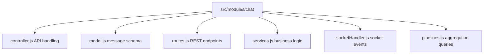
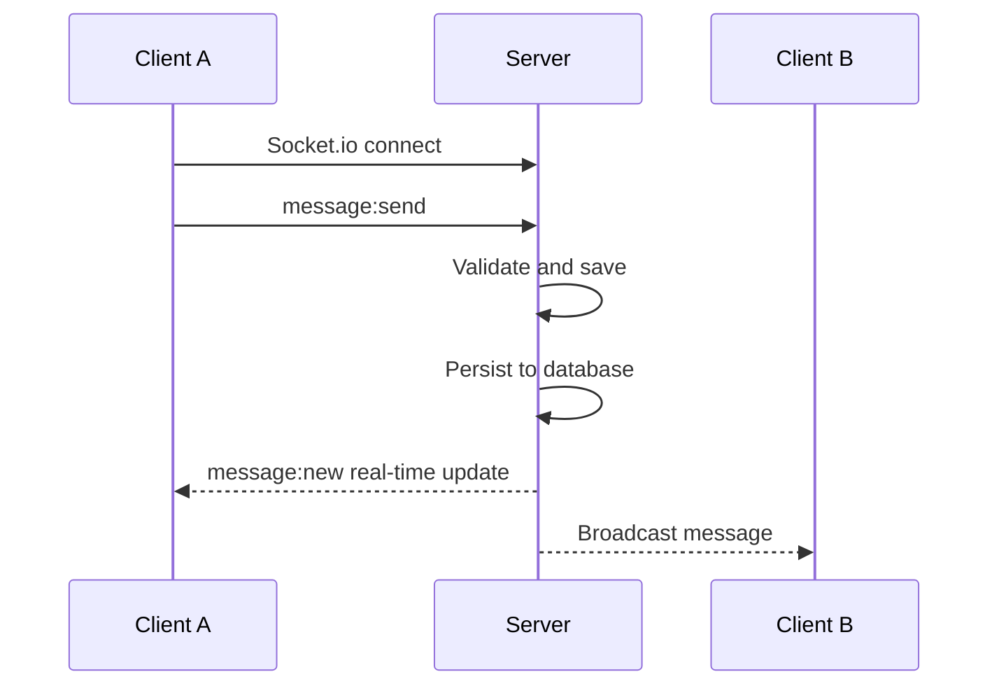

# Chat Module Documentation

**START HERE:** Read [docs/INDEX.md](../../INDEX.md) first to understand the project structure and documentation guide.

**IMPORTANT:** Before making any changes, read [docs/AGENT_GUIDELINES.md](../../AGENT_GUIDELINES.md) to understand coding standards and architecture patterns.

## Overview

The Chat Module provides real-time messaging for workspaces. It handles sending/receiving messages, reactions, typing indicators, and message persistence.

**Module Location:** `src/modules/chat/`

## Table of Contents

1. [Business Logic](#business-logic)
2. [Architecture](#architecture)
3. [Database Schema](#database-schema)
4. [API Endpoints](#api-endpoints)
5. [Socket.io Events](#socketio-events)
6. [Message Types](#message-types)

## Business Logic

### Workspace Chat

- Messages scoped to a workspace
- Only workspace members can view/send messages
- Messages persist in database
- Real-time delivery via Socket.io

### Message Features

- **Text messages**: Regular text content
- **Edited messages**: Track edit history
- **Deleted messages**: Soft delete (show "Message deleted")
- **Reactions**: Emoji reactions on messages
- **Mentions**: @mention workspace members
- **Threads**: Optional message threading (if implemented)

### Permission Rules

```
- Send message: Must be workspace member
- View messages: Must be workspace member
- Edit message: Only message author
- Delete message: Author or workspace owner
- React to message: Any workspace member
```

## Architecture

### File Structure



### Real-time Architecture



## Database Schema

### Message Collection

```javascript
{
  _id: ObjectId,
  workspaceId: ObjectId (ref: Workspace),
  sender: ObjectId (ref: User),       // Who sent
  content: String (required),         // Message text
  type: String (default: 'text'),     // 'text', 'image', 'file'

  // Optional: For file/image messages
  attachment: {
    url: String,
    type: String,                     // mime type
    name: String,
    size: Number
  },

  // Reactions
  reactions: [
    {
      emoji: String,                  // "👍", "❤️", etc
      users: [ObjectId (ref: User)]   // Who reacted
    }
  ],

  // Mentions
  mentions: [ObjectId (ref: User)],   // @mentioned users

  // Editing
  isEdited: Boolean (default: false),
  editedAt: Date,
  originalContent: String,            // For tracking edits (optional)

  // Deletion
  isDeleted: Boolean (default: false), // Soft delete
  deletedAt: Date,

  createdAt: Date (auto),
  updatedAt: Date (auto)
}
```

### Key Fields - Required vs Optional

| Field       | Required | Type     | Notes                        |
| ----------- | -------- | -------- | ---------------------------- |
| workspaceId | ✅       | ObjectId | Messages scoped to workspace |
| sender      | ✅       | ObjectId | Who sent the message         |
| content     | ✅       | String   | Message text                 |
| type        | ❌       | String   | Default: 'text'              |
| reactions   | ❌       | Array    | Empty by default             |
| isEdited    | ❌       | Boolean  | Default: false               |
| isDeleted   | ❌       | Boolean  | Default: false (soft delete) |
| createdAt   | ✅       | Date     | Auto-set by Mongoose         |

### Indexes

```javascript
// Fast message retrieval
schema.index({ workspaceId: 1, createdAt: -1 });

// User messages lookup
schema.index({ sender: 1, createdAt: -1 });

// For full-text search
schema.index({ content: "text" });

// TTL for auto-cleanup (optional)
schema.index({ deletedAt: 1 }, { expireAfterSeconds: 2592000 }); // 30 days
```

## API Endpoints

### GET `/api/workspaces/:workspaceId/messages`

**Purpose:** Get all messages in a workspace

**Query Parameters:**

```
limit: Number (default: 50, max: 100)
page: Number (default: 1)
sortBy: 'createdAt' (default)
```

**Response:**

```json
{
  "success": true,
  "data": {
    "messages": [
      {
        "_id": "507f...",
        "workspaceId": "507f...",
        "sender": {
          "_id": "507f...",
          "firstName": "John",
          "email": "john@example.com"
        },
        "content": "Hello team!",
        "type": "text",
        "reactions": [
          {
            "emoji": "👍",
            "users": [
              /* ... */
            ]
          }
        ],
        "createdAt": "2024-03-28T10:00:00Z",
        "isEdited": false
      }
    ],
    "pagination": {
      "total": 150,
      "page": 1,
      "limit": 50,
      "totalPages": 3
    }
  }
}
```

---

### POST `/api/workspaces/:workspaceId/messages`

**Purpose:** Send a message to workspace

**Request Body:**

```json
{
  "content": "Great discussion!",
  "type": "text",
  "mentions": ["userId1", "userId2"]
}
```

**Response (Success - 201):**

```json
{
  "success": true,
  "data": {
    "_id": "507f...",
    "workspaceId": "507f...",
    "sender": {
      "_id": "507f...",
      "firstName": "John",
      "email": "john@example.com"
    },
    "content": "Great discussion!",
    "mentions": ["userId1", "userId2"],
    "createdAt": "2024-03-28T10:15:00Z"
  }
}
```

**Business Rules:**

- Must be workspace member
- Content required, max 5000 characters
- Mentions must be valid workspace members
- Message persisted to DB before broadcast

---

### PUT `/api/messages/:messageId`

**Purpose:** Edit a message

**Request Body:**

```json
{
  "content": "Updated message text"
}
```

**Business Rules:**

- Only message author can edit
- EditeAt timestamp updated
- Original content preserved (optional)
- Broadcast edit event to workspace

---

### DELETE `/api/messages/:messageId`

**Purpose:** Delete a message

**Business Rules:**

- Author or workspace owner can delete
- Soft delete (isDeleted = true)
- Content replaced with "Message deleted"
- Reactions preserved (optional)
- Broadcast delete event

---

### POST `/api/messages/:messageId/reactions`

**Purpose:** Add reaction to message

**Request Body:**

```json
{
  "emoji": "👍"
}
```

**Response:**

```json
{
  "success": true,
  "data": {
    "_id": "507f...",
    "reactions": [{ "emoji": "👍", "users": ["userId1", "userId2"] }]
  }
}
```

---

### DELETE `/api/messages/:messageId/reactions/:emoji`

**Purpose:** Remove reaction from message

**Response:**

```json
{
  "success": true,
  "data": {
    "emoji": "👍",
    "users": ["userId2"] // After removal
  }
}
```

---

## Socket.io Events

### Server → Client Events

**message:new** - New message posted

```javascript
socket.emit("message:new", {
  _id: "507f...",
  workspaceId: "507f...",
  sender: { _id, firstName, email },
  content: "Hello!",
  createdAt: "2024-03-28T10:00:00Z",
});
```

**message:edited** - Message edited

```javascript
socket.emit("message:edited", {
  _id: "507f...",
  content: "Edited content",
  isEdited: true,
  editedAt: "2024-03-28T10:05:00Z",
});
```

**message:deleted** - Message deleted

```javascript
socket.emit("message:deleted", {
  _id: "507f...",
  isDeleted: true,
  deletedAt: "2024-03-28T10:10:00Z",
});
```

**user:typing** - User is typing

```javascript
socket.emit("user:typing", {
  userId: "507f...",
  firstName: "John",
  workspaceId: "507f...",
});
```

**user:stopped-typing** - User stopped typing

```javascript
socket.emit("user:stopped-typing", {
  userId: "507f...",
  workspaceId: "507f...",
});
```

**reaction:added** - Reaction added

```javascript
socket.emit("reaction:added", {
  messageId: "507f...",
  emoji: "👍",
  userId: "507f...",
  totalCount: 3,
});
```

### Client → Server Events

**message:send** - Send message

```javascript
socket.emit("message:send", {
  workspaceId: "507f...",
  content: "Hello team!",
  type: "text",
});
```

**user:typing** - User typing indicator

```javascript
socket.emit("user:typing", {
  workspaceId: "507f...",
});
```

**user:stopped-typing** - End typing

```javascript
socket.emit("user:stopped-typing", {
  workspaceId: "507f...",
});
```

**reaction:toggle** - Add/remove reaction

```javascript
socket.emit("reaction:toggle", {
  messageId: "507f...",
  emoji: "👍",
});
```

## Message Types

### Text Messages

Simple text messages with optional mentions

```javascript
{
  type: 'text',
  content: 'Hey @John, great work!',
  mentions: ['userId..']
}
```

### System Messages (Optional)

Announcements like "User joined workspace"

```javascript
{
  type: 'system',
  content: 'John joined the workspace',
  systemAction: 'user_joined'
}
```

### Media Messages (Optional)

For images/files

```javascript
{
  type: 'image',
  content: 'Check out this diagram',
  attachment: {
    url: 's3://...',
    type: 'image/png',
    name: 'diagram.png'
  }
}
```

## Implementation Patterns

### Handling Mentions

```javascript
async sendMessage({ workspaceId, content, mentions, user }) {
  // 1. Validate mentions are workspace members
  const workspace = await Workspace.findById(workspaceId);
  const validMembers = workspace.members.map(m => m.user.toString());

  const invalidMentions = mentions.filter(m => !validMembers.includes(m));
  if (invalidMentions.length > 0) {
    throw new ApiError("Invalid mentions", 400);
  }

  // 2. Create message with mentions
  const message = await this.create({
    workspaceId,
    sender: user.id,
    content,
    mentions,
    type: 'text'
  });

  // 3. Notify mentioned users
  await this.notifyMentions(message, mentions);

  return message;
}
```

### Soft Delete Messages

```javascript
async deleteMessage(messageId, user) {
  const message = await this.findById(messageId);

  // Check permission
  if (message.sender.toString() !== user.id.toString()) {
    // Check if user is workspace owner
    const ws = await Workspace.findById(message.workspaceId);
    if (ws.owner.toString() !== user.id.toString()) {
      throw new ApiError("Not authorized", 403);
    }
  }

  // Soft delete
  return await this.updateOne(
    { _id: messageId },
    {
      $set: {
        isDeleted: true,
        deletedAt: new Date(),
        content: 'Message deleted'
      }
    }
  );
}
```

### Typing Indicators (Socket.io)

```javascript
// Client sends every 1 second while typing
socket.emit("user:typing", { workspaceId });

// Server broadcasts to workspace
socket.on("user:typing", ({ workspaceId }) => {
  socket.broadcast.emit("user:typing", {
    userId,
    firstName,
    workspaceId,
  });
});

// Client stops typing after 2 seconds inactivity
socket.emit("user:stopped-typing", { workspaceId });
```

## UI Specifications

### Message Display

**Components for each message:**

- User avatar
- User name
- Timestamp (relative, e.g., "2 min ago")
- Message content
- Edited badge (if edited)
- Reaction pills (emoji + count)
- Actions menu (edit, delete, react)

### New Message Input

**Features:**

- Text input area
- Mention support (@mentions)
- Emoji picker
- File/image upload (optional)
- Send button
- Character counter (max 5000)

### Messaging States

- **Sending**: Show loading indicator
- **Sent**: Show checkmark
- **Failed**: Show error with retry button
- **Typing**: Show "John is typing..."

### Reaction UI

- Emoji reactions as clickable pills below message
- Click to toggle your reaction
- Hover to see who reacted

## Common Issues & Solutions

| Issue                    | Cause                        | Solution                           |
| ------------------------ | ---------------------------- | ---------------------------------- |
| Messages not real-time   | Socket.io not connected      | Check socket auth, connection logs |
| Duplicate messages       | Message saved twice          | Use idempotency key                |
| Old messages not loading | Missing pagination           | Implement limit/offset in API      |
| Typing indicator stuck   | User disconnect not captured | Clear indicators on disconnect     |
| Mentions not working     | Invalid user IDs             | Validate mentions before saving    |

## Future Enhancements

- Message search/filtering
- Message threading/replies
- Pin important messages
- Message reactions with custom emojis
- Read receipts
- Message forwarding
- Bulk actions (select multiple, delete)
- Message pinning
- Archive old conversations
- Link previews
- Inline code syntax highlighting

---

**Module Version**: 1.0.0
**Last Updated**: March 28, 2024
