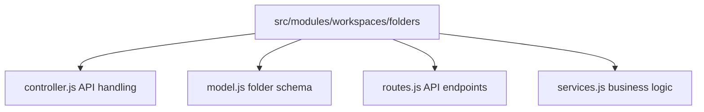
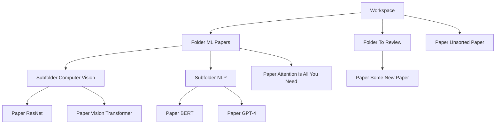

# Folders Module Documentation

**START HERE:** Read [docs/INDEX.md](../../INDEX.md) first to understand the project structure and documentation guide.

**IMPORTANT:** Before making any changes, read [docs/AGENT_GUIDELINES.md](../../AGENT_GUIDELINES.md) to understand coding standards and architecture patterns.

## Overview

The Folders Module enables organization of saved papers within workspaces through a hierarchical folder structure. Users can create folders, organize papers, and manage folder hierarchy.

**Module Location:** `src/modules/workspaces/folders/`

## Business Logic

### Folder Structure

- Workspaces contain folders (1:N relationship)
- Folders can contain subfolders (hierarchical)
- Folders can contain papers via SavedPaper module
- Folder tree maintained with `parentFolder` references

### Permission Rules

```
- Create folder: Any workspace member
- Edit folder: Creator or workspace owner
- Delete folder: Creator or workspace owner
- Move papers: Any workspace member
- Delete papers in folder: Only workspace owner or paper owner
```

### Folder Operations

1. **Create Folder**: Create new folder in workspace or subfolder
2. **Rename Folder**: Change folder name
3. **Delete Folder**: Remove folder (handle papers - move or cascade)
4. **Move Folder**: Move to different parent folder
5. **List Folder**: Get folder tree structure
6. **Add Paper**: Save paper to specific folder

## Architecture

### File Structure



### Folder Hierarchy Representation



## Database Schema

### Folder Collection

```javascript
{
  _id: ObjectId,
  workspaceId: ObjectId (ref: Workspace, indexed),
  name: String (required, indexed),
  parentFolder: ObjectId (ref: Folder, nullable),  // null for root folders
  createdBy: ObjectId (ref: User),                // Creator
  color: String,           // Optional: folder color badge
  icon: String,           // Optional: folder icon
  description: String,     // Optional: folder description
  paperCount: Number,      // Cached count (update on add/remove)
  subfolderCount: Number,  // Cached count
  createdAt: Date (auto),
  updatedAt: Date (auto)
}
```

### Key Fields

| Field        | Required | Type     | Notes                         |
| ------------ | -------- | -------- | ----------------------------- |
| workspaceId  | ✅       | ObjectId | Folder belongs to workspace   |
| name         | ✅       | String   | Folder name (min 1, max 100)  |
| parentFolder | ❌       | ObjectId | Parent folder (null for root) |
| createdBy    | ✅       | ObjectId | Creator user                  |
| color        | ❌       | String   | Hex color for UI              |
| description  | ❌       | String   | Optional description          |

### Indexes

```javascript
// Find folders by workspace
schema.index({ workspaceId: 1, parentFolder: 1 });

// Fast folder lookup by name in workspace
schema.index({ workspaceId: 1, name: 1 });

// Find subfolders of a folder
schema.index({ parentFolder: 1 });

// User's folders
schema.index({ createdBy: 1, workspaceId: 1 });
```

## API Endpoints

### POST `/api/workspaces/:workspaceId/folders`

**Purpose:** Create a new folder

**Request Body:**

```json
{
  "name": "Computer Vision",
  "parentFolder": "507f...", // Optional, for subfolders
  "color": "#6366f1",
  "description": "Papers on vision tasks"
}
```

**Response (Success - 201):**

```json
{
  "success": true,
  "message": "Folder created",
  "data": {
    "_id": "507f...",
    "workspaceId": "507f...",
    "name": "Computer Vision",
    "parentFolder": "507f...",
    "createdBy": "507f...",
    "color": "#6366f1",
    "description": "Papers on vision tasks",
    "paperCount": 0,
    "subfolderCount": 0,
    "createdAt": "2024-03-28T10:00:00Z"
  }
}
```

**Business Rules:**

- User must be workspace member
- Folder name required, max 100 chars
- Parent folder must exist in same workspace
- Prevent circular references (A → B → A)
- Max folder depth: 5 levels (optional)

**Error Codes:**

- 400: Missing name, circular reference
- 403: Not workspace member
- 404: Parent folder not found

---

### GET `/api/workspaces/:workspaceId/folders`

**Purpose:** Get folder tree for workspace

**Response:**

```json
{
  "success": true,
  "data": {
    "folders": [
      {
        "_id": "507f...",
        "name": "ML Papers",
        "parentFolder": null,
        "createdBy": "507f...",
        "color": "#6366f1",
        "paperCount": 8,
        "subfolderCount": 2,
        "subfolders": [
          {
            "_id": "507f...",
            "name": "Computer Vision",
            "parentFolder": "507f...",
            "paperCount": 5,
            "subfolderCount": 0,
            "subfolders": []
          },
          {
            "_id": "507f...",
            "name": "NLP",
            "parentFolder": "507f...",
            "paperCount": 3,
            "subfolderCount": 0
          }
        ]
      }
    ]
  }
}
```

**Business Rules:**

- Only returns folders user has access to
- Hierarchical structure with nested subfolders
- Paper counts are cached values
- Sorted by creation date

---

### GET `/api/workspaces/:workspaceId/folders/:folderId`

**Purpose:** Get folder details and papers in it

**Query Parameters:**

```
limit: Number (default: 20)
page: Number (default: 1)
```

**Response:**

```json
{
  "success": true,
  "data": {
    "folder": {
      "_id": "507f...",
      "name": "Computer Vision",
      "parentFolder": "507f...",
      "createdBy": "507f...",
      "paperCount": 5
    },
    "papers": [
      {
        "_id": "507f...",
        "paperId": "507f...",
        "title": "ResNet: Deep Residual Learning",
        "authors": ["Kaiming He"],
        "savedAt": "2024-03-28T10:00:00Z"
      }
    ],
    "pagination": {
      "total": 5,
      "page": 1,
      "limit": 20,
      "totalPages": 1
    }
  }
}
```

---

### PUT `/api/workspaces/:workspaceId/folders/:folderId`

**Purpose:** Update folder

**Request Body:**

```json
{
  "name": "New Folder Name",
  "color": "#8b5cf6",
  "description": "Updated description",
  "parentFolder": "507f..." // Move to different parent
}
```

**Business Rules:**

- Only creator or workspace owner can update
- Check circular references if moving
- Update updatedAt timestamp
- Broadcast update to workspace members

---

### DELETE `/api/workspaces/:workspaceId/folders/:folderId`

**Purpose:** Delete folder

**Query Parameters:**

```
action: 'delete' | 'relocate'
relocateTo: ObjectId (if action is 'relocate')
```

**Business Rules:**

- Only creator or workspace owner can delete
- If action is 'delete':
  - Delete folder and all subfolders
  - Handle papers: move to parent folder or workspace root
  - Cascade delete empty subfolders
- If action is 'relocate':
  - Move all papers to target folder
  - Delete empty folder

**Response:**

```json
{
  "success": true,
  "message": "Folder deleted",
  "data": {
    "deletedFolderId": "507f...",
    "papersRelocated": 5,
    "subfoldersDeleted": 2
  }
}
```

---

### POST `/api/workspaces/:workspaceId/folders/:folderId/papers`

**Purpose:** Add paper to folder

**Request Body:**

```json
{
  "paperId": "507f..."
}
```

**Business Rules:**

- Paper must be saved to workspace
- Paper can be in multiple folders
- Creates SavedPaper instance if not exists

---

## Folder Tree Query

### Get Full Tree Structure

```javascript
async getFolderTree(workspaceId) {
  // 1. Get all root folders
  const rootFolders = await Folder.find({
    workspaceId,
    parentFolder: null
  });

  // 2. For each folder, recursively fetch subfolders
  for (let folder of rootFolders) {
    folder.subfolders = await this.getSubfolders(folder._id);
  }

  return rootFolders;
}

async getSubfolders(folderId) {
  const subfolders = await Folder.find({ parentFolder: folderId });

  for (let subfolder of subfolders) {
    subfolder.subfolders = await this.getSubfolders(subfolder._id);
  }

  return subfolders;
}
```

### Check Circular Reference

```javascript
async hasCircularReference(folderId, targetParentId) {
  let current = targetParentId;

  while (current) {
    const folder = await Folder.findById(current);

    if (!folder) break;

    // If we reach the folder we're trying to move, it's circular
    if (folder._id.toString() === folderId.toString()) {
      return true;
    }

    current = folder.parentFolder;
  }

  return false;
}
```

## Integration with Saved Papers

### Folder-Paper Relationship

```
SavedPaper {
  paperId: ObjectId,
  workspaceId: ObjectId,
  folderId: ObjectId (optional, ref: Folder),
  savedBy: ObjectId,
  notes: String
}
```

### Move Paper to Folder

```javascript
async movePaperToFolder(savedPaperId, newFolderId, user) {
  const savedPaper = await SavedPaper.findById(savedPaperId);

  // Only owner or workspace owner
  if (savedPaper.savedBy !== user.id && !user.isAdmin) {
    throw new ApiError("Not authorized", 403);
  }

  // Check folder exists in same workspace
  const folder = await Folder.findById(newFolderId);
  if (!folder || folder.workspaceId !== savedPaper.workspaceId) {
    throw new ApiError("Folder not found", 404);
  }

  // Move paper
  return await SavedPaper.updateOne(
    { _id: savedPaperId },
    { $set: { folderId: newFolderId } }
  );
}
```

## Performance Optimization

### Caching Paper Counts

```javascript
async updateFolderCounts(folderId) {
  // Count papers in this folder
  const paperCount = await SavedPaper.countDocuments({
    folderId
  });

  // Count subfolders
  const subfolderCount = await Folder.countDocuments({
    parentFolder: folderId
  });

  await Folder.updateOne(
    { _id: folderId },
    { $set: { paperCount, subfolderCount } }
  );
}
```

Call this after:

- Adding paper to folder
- Removing paper from folder
- Creating/deleting subfolder

### Pagination for Large Folders

```javascript
async getFolderPapers(folderId, page = 1, limit = 20) {
  const skip = (page - 1) * limit;

  return await SavedPaper.find({ folderId })
    .skip(skip)
    .limit(limit)
    .sort({ savedAt: -1 });
}
```

## UI Specifications

### Folder Tree View

**Components:**

- Expandable/collapsible folder items
- Folder icon with name
- Paper count badge
- Right-click context menu (edit, delete, new folder)
- Drag-and-drop to move papers
- Color-coded folders

### Folder Operations Menu

**Actions:**

- New subfolder
- Rename
- Change color
- Delete (with options to relocate papers)
- Share (optional)
- Archive (optional)

### Paper Management in Folder

**Features:**

- List papers in folder
- Add paper button
- Remove from folder button
- Drag papers between folders
- Bulk actions (move, delete)
- Sort options (name, date added)

## Common Issues & Solutions

| Issue                        | Cause                          | Solution                          |
| ---------------------------- | ------------------------------ | --------------------------------- |
| Circular reference error     | Moving folder to its subfolder | Validate parent chain before move |
| Paper counts wrong           | Cache not updated              | Recalculate counts on add/remove  |
| Slow tree loading            | Deep nesting                   | Paginate folders, limit depth     |
| Papers lost on folder delete | No migration logic             | Handle papers gracefully          |
| Old papers in folder         | No archive                     | Implement archive with TTL        |

## Best Practices

1. **Folder Naming**
   - Keep names concise (max 50 chars)
   - Use consistent naming scheme
   - Avoid special characters

2. **Organization**
   - Limit depth to 3-5 levels
   - Move papers to appropriate folders
   - Archive old papers

3. **Performance**
   - Cache counts
   - Pagination for large folders
   - Lazy load subfolders

## Future Enhancements

- Folder templates (pre-built structures)
- Folder color customization
- Folder sharing with permission levels
- Smart folders (auto-organized by criteria)
- Folder search
- Favorites/starred folders
- Folder statistics (papers, modified date)
- Archive old folders
- Folder history/audit log

---

**Module Version**: 1.0.0
**Last Updated**: March 28, 2024
