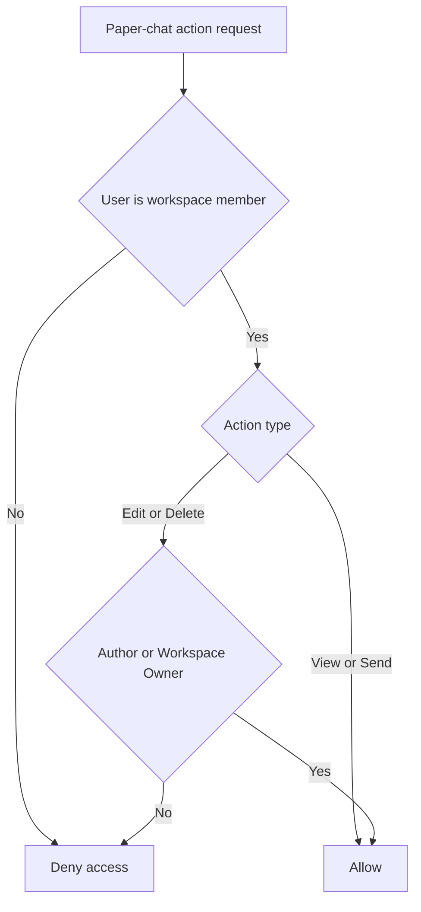
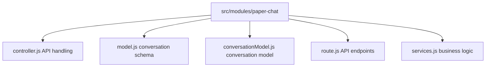
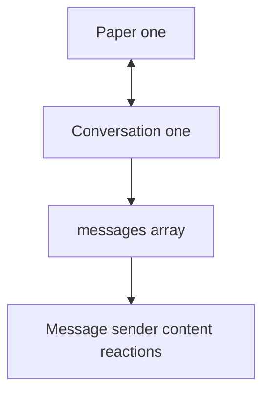
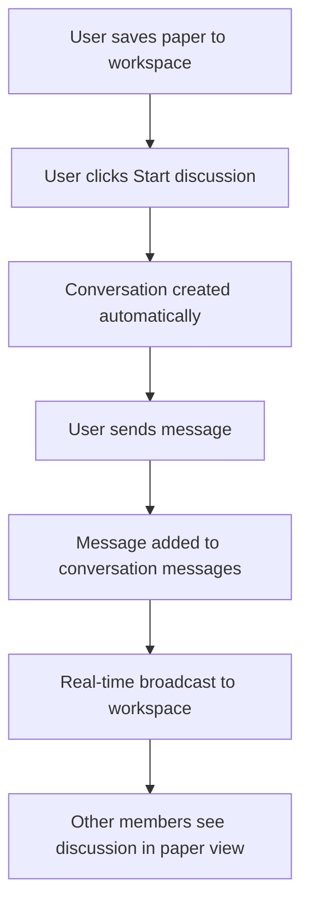

# Paper-Chat Module Documentation

**START HERE:** Read [docs/INDEX.md](../../INDEX.md) first to understand the project structure and documentation guide.

**IMPORTANT:** Before making any changes, read [docs/AGENT_GUIDELINES.md](../../AGENT_GUIDELINES.md) to understand coding standards and architecture patterns.

## Overview

The Paper-Chat Module manages discussions specific to individual research papers. It enables team members to have threaded conversations about particular papers within workspaces.

**Module Location:** `src/modules/paper-chat/`

## Table of Contents

1. [Business Logic](#business-logic)
2. [Architecture](#architecture)
3. [Database Schema](#database-schema)
4. [API Endpoints](#api-endpoints)
5. [Integration with Papers Module](#integration-with-papers-module)

## Business Logic

### Conversation Model

- Each paper can have ONE conversation
- Conversation contains multiple messages
- Messages are nested within conversation document
- Scoped to workspace (paper + workspace combo)

### Access Control



### AI Summaries

- System can generate conversation summaries
- Summarize discussion points about paper
- Optional AI-powered insights

## Architecture

### File Structure



### Data Design

Paper-Chat uses a **nested document model** where messages are embedded in the conversation document:

```javascript
Conversation {
  _id: ObjectId,
  paperId: ObjectId,
  workspaceId: ObjectId,
  messages: [
    { _id, sender, content, createdAt },
    { _id, sender, content, createdAt },
    ...
  ]
}
```

## Database Schema

### Conversation Collection

```javascript
{
  _id: ObjectId,
  paperId: ObjectId (ref: Paper, indexed),
  workspaceId: ObjectId (ref: Workspace, indexed),

  // Nested messages
  messages: [
    {
      _id: ObjectId,
      sender: ObjectId (ref: User),
      content: String,
      type: String (default: 'text'),

      // Reactions
      reactions: [
        {
          emoji: String,
          users: [ObjectId]
        }
      ],

      // Editing
      isEdited: Boolean,
      editedAt: Date,

      // Deletion
      isDeleted: Boolean,
      deletedAt: Date,

      createdAt: Date
    }
  ],

  // Metadata
  messageCount: Number,           // Total messages in conversation
  participantCount: Number,       // Unique participants
  lastMessageAt: Date,            // For sorting

  // AI-generated summaries (optional)
  summaries: [
    {
      generatedAt: Date,
      summary: String,
      keyPoints: [String],
      aiModel: String
    }
  ],

  createdAt: Date (auto),
  updatedAt: Date (auto)
}
```

### Index Strategy

```javascript
// Find conversation by paper + workspace
schema.index({ paperId: 1, workspaceId: 1 });

// List conversations in workspace
schema.index({ workspaceId: 1, lastMessageAt: -1 });

// Find papers with active discussions
schema.index({ paperId: 1, messageCount: -1 });
```

## API Endpoints

### GET `/api/papers/:paperId/chat`

**Purpose:** Get conversation for a paper

**Query Parameters:**

```
workspaceId: ObjectId (required)
limit: Number (default: 50, for pagination through messages)
```

**Response:**

```json
{
  "success": true,
  "data": {
    "conversationId": "507f...",
    "paperId": "507f...",
    "workspaceId": "507f...",
    "messageCount": 15,
    "participantCount": 3,
    "messages": [
      {
        "_id": "507f...",
        "sender": {
          "_id": "507f...",
          "firstName": "John",
          "email": "john@example.com"
        },
        "content": "This paper is interesting because...",
        "type": "text",
        "reactions": [{ "emoji": "👍", "users": ["userId1"] }],
        "isEdited": false,
        "createdAt": "2024-03-28T10:00:00Z"
      }
    ],
    "summaries": [
      {
        "generatedAt": "2024-03-28T11:00:00Z",
        "summary": "Discussion focused on the paper's novel approach...",
        "keyPoints": ["New methodology", "Performance improvement"]
      }
    ]
  }
}
```

**Business Rules:**

- User must be workspace member
- Conversation created automatically on first message
- If no messages, return empty conversation
- Messages paginated (load older on scroll)

---

### POST `/api/papers/:paperId/chat`

**Purpose:** Send message in paper discussion

**Request Body:**

```json
{
  "workspaceId": "507f...",
  "content": "I think this methodology is flawed because...",
  "type": "text"
}
```

**Response (Success - 201):**

```json
{
  "success": true,
  "data": {
    "_id": "507f...", // Message ID
    "conversationId": "507f...",
    "sender": {
      "_id": "507f...",
      "firstName": "John",
      "email": "john@example.com"
    },
    "content": "I think this methodology is flawed because...",
    "createdAt": "2024-03-28T10:15:00Z"
  }
}
```

**Business Rules:**

- User must be workspace member
- Paper must exist and be accessible to user
- Conversation auto-created if not exists
- MessageCount incremented
- lastMessageAt updated
- Triggers real-time update to workspace

---

### PUT `/api/papers/:paperId/chat/messages/:messageId`

**Purpose:** Edit a message in discussion

**Request Body:**

```json
{
  "content": "I think this methodology is flawed because of X reason"
}
```

**Business Rules:**

- Only message author can edit
- isEdited set to true
- editedAt timestamp added
- Workspace owner can also edit

---

### DELETE `/api/papers/:paperId/chat/messages/:messageId`

**Purpose:** Delete message from discussion

**Business Rules:**

- Author or workspace owner can delete
- isDeleted set to true
- Message content replaced
- Reactions preserved
- messageCount decremented

---

### POST `/api/papers/:paperId/chat/summaries`

**Purpose:** Generate AI summary of discussion

**Query Parameters:**

```
workspaceId: ObjectId (required)
```

**Response:**

```json
{
  "success": true,
  "data": {
    "summary": "The team discussed the paper's novel approach to NLP...",
    "keyPoints": [
      "Introduces transformer-based architecture",
      "Shows 15% improvement over baselines",
      "Concerns raised about computational cost"
    ],
    "generatedAt": "2024-03-28T11:00:00Z",
    "aiModel": "gpt-4"
  }
}
```

**Business Rules:**

- Only workspace members can request
- Summary appended to summaries array
- Async operation (returns immediately)
- Max one summary per hour

---

### POST `/api/papers/:paperId/chat/reactions`

**Purpose:** React to a message

**Request Body:**

```json
{
  "workspaceId": "507f...",
  "messageId": "507f...",
  "emoji": "👍"
}
```

---

## Integration with Papers Module

### Relationship



### Workflow



### Checking Paper Accessibility

```javascript
async sendMessage({ paperId, workspaceId, content, user }) {
  // 1. Check if user is workspace member
  const workspace = await Workspace.findById(workspaceId);
  const isMember = workspace.members.some(m => m.user === user.id);
  if (!isMember) throw new ApiError("Not member", 403);

  // 2. Check if paper is accessible in workspace
  const savedPaper = await SavedPaper.findOne({
    paperId,
    workspaceId
  });
  if (!savedPaper) throw new ApiError("Paper not in workspace", 404);

  // 3. Get or create conversation
  let conversation = await Conversation.findOne({
    paperId,
    workspaceId
  });

  if (!conversation) {
    conversation = await Conversation.create({
      paperId,
      workspaceId,
      messages: []
    });
  }

  // 4. Add message
  const message = {
    _id: new ObjectId(),
    sender: user.id,
    content,
    createdAt: new Date()
  };

  conversation.messages.push(message);
  conversation.messageCount = conversation.messages.length;
  conversation.lastMessageAt = new Date();

  await conversation.save();

  return message;
}
```

## Socket.io Integration

**Events for paper-chat:**

```javascript
// Client sends
socket.emit("paper:message", {
  paperId,
  workspaceId,
  content,
});

// Server broadcasts to workspace
socket.broadcast.to(workspaceId).emit("paper:message:new", {
  paperId,
  message: { _id, sender, content, createdAt },
});
```

## Message Nesting Strategy

### Pros of Nested Approach

- ✅ All messages in one place
- ✅ Atomic updates
- ✅ Simpler queries

### Cons

- ❌ Document size grows with messages
- ❌ Hard to paginate old messages
- ❌ MongoDB BSON size limit (16MB)

### When to Switch to Separate Messages Collection

If conversation exceeds 1000 messages:

```javascript
// Switch to separate collection
db.paperchatmessages.find({ conversationId });
```

## UI Specifications

### Paper Detail View - Chat Section

**Layout:**

- Messages list (scrollable)
- User avatar + name next to each message
- Timestamp
- Reaction pills
- Edit/delete actions (author only)

### Message Input

**Features:**

- Text input
- Send button
- Character counter
- Emoji picker
- @mention support (optional)

### Loading States

- **Loading messages**: Spinner in messages area
- **Sending message**: Optimistic update + loading state
- **Generating summary**: Progress indicator

### Summary Display

- Collapsible summary box
- Key points as bullet list
- "Generated X minutes ago" timestamp

## Common Issues & Solutions

| Issue                     | Cause               | Solution                            |
| ------------------------- | ------------------- | ----------------------------------- |
| Conversation not created  | First message fails | Ensure validation before create     |
| Document too large        | Too many messages   | Implement message archiving         |
| Messages not loading      | Bad paperId         | Validate paper exists               |
| Summary generation slow   | API timeout         | Implement async with notifications  |
| Old messages not accessed | Missing pagination  | Load more button for older messages |

## Best Practices

1. **Document Size Monitoring**
   - Monitor paper conversation sizes
   - Archive old messages if > 1000
   - Consider migration to separate collection

2. **Performance**
   - Limit messages returned in API (default 50)
   - Use pagination for older messages
   - Cache summaries

3. **Moderation**
   - Only workspace owner can delete others' messages
   - Authors can edit/delete own messages within time limit
   - Report inappropriate content

## Future Enhancements

- Message threading (sub-discussions)
- Voice notes
- Paper annotations
- Code snippet sharing
- Citation linking in messages
- Discussion export to PDF
- Message search within conversation
- Notification settings (mention, summary generated)
- Integration with calendar (schedule paper reviews)
- AI-powered insights

---

**Module Version**: 1.0.0
**Last Updated**: March 28, 2024
